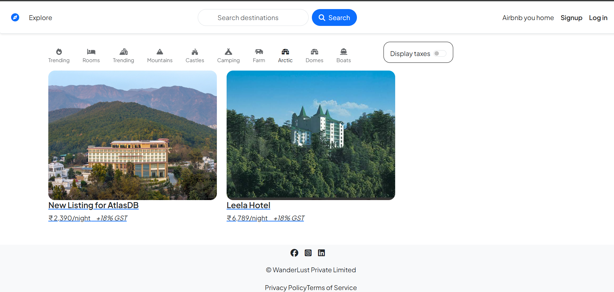
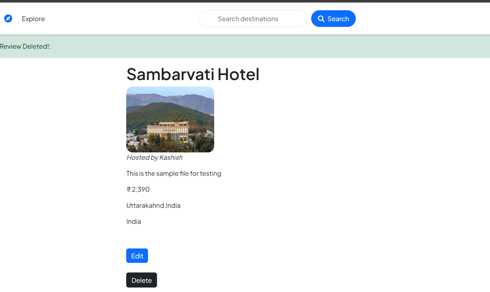
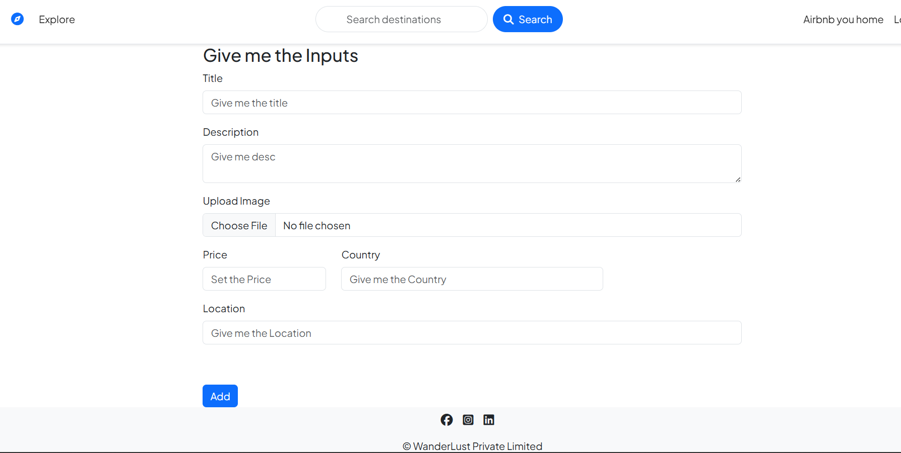

# 🌍 Wanderlust

> A full-stack Airbnb-inspired web app where users can explore, list, and manage property stays — with authentication, reviews, and image uploads. Built with Node.js, Express, MongoDB, and EJS.

🔗 **Live Demo:** [wanderlust-0flc.onrender.com](https://wanderlust-0flc.onrender.com/listings)

---

## 📸 Screenshots

### Home Page


### Listings Page


### Login Page



## ✨ Features

- Browse all property listings
- Create, edit, and delete your own listings
- Upload images for listings
- User signup, login, and logout
- Only listing owners can edit/delete their listings
- Add, view, and delete reviews on listings
- Responsive UI

---

## 🛠️ Tech Stack

- **Backend:** Node.js, Express.js
- **Database:** MongoDB, Mongoose
- **Frontend:** EJS, Bootstrap, CSS
- **Auth:** Passport.js (session-based)
- **Image Hosting:** Cloudinary
- **Deployment:** Render

---

## 🏁 Setup

### Prerequisites
- Node.js & npm
- MongoDB running locally or a MongoDB Atlas URI
- Cloudinary account (for image uploads)

### 1. Clone the repository
```
git clone https://github.com/AGGARWALUDAY/Wanderlust.git
cd Wanderlust
```

### 2. Install dependencies
```
npm install
```

### 3. Configure environment variables
Create a `.env` file in the root directory with your MongoDB URI, Cloudinary credentials, and session secret.

### 4. Run the app
```
node app.js
```

The app will be live at `http://localhost:3000` (or your configured port).

---

## 📁 Folder Structure

```
Wanderlust/
├── init/
├── models/
├── public/
├── routes/
├── utils/
├── views/
├── app.js
└── schema.js
```